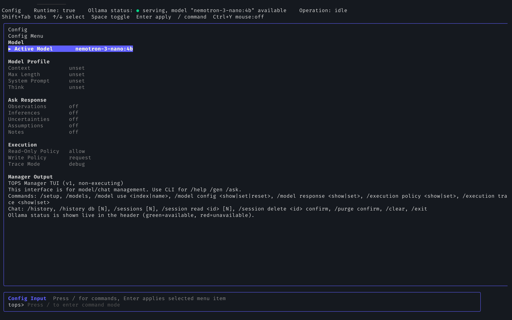
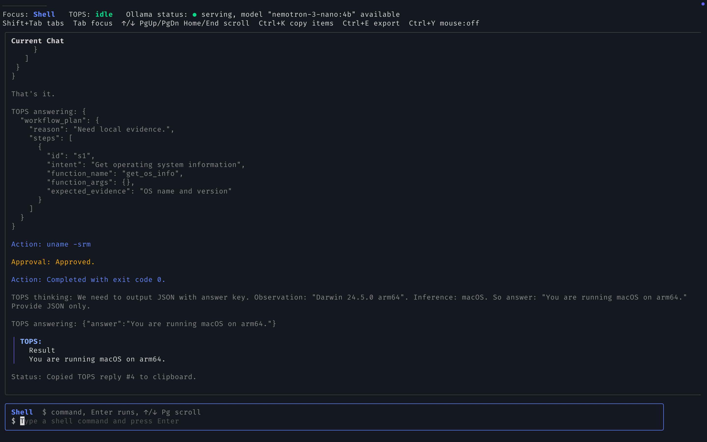
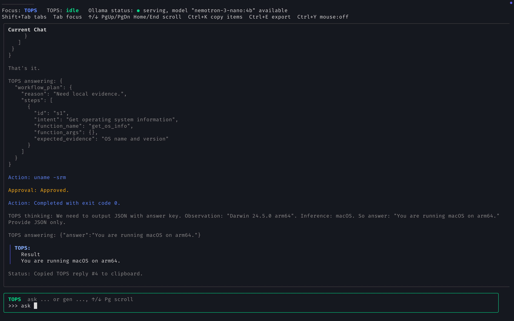

# TOPS

TOPS (**Terminal Operations System**) is a terminal-native assistant for:

- understanding commands (`tps help`)
- generating commands from natural language (`tps gen`)
- answering local system questions with grounded evidence (`tps ask`)
- rerunning generated commands from Command Memory (`tps run`)

It is designed to be explainable and safety-conscious, not a fully autonomous shell agent.

## What TOPS is (and is not)

TOPS is:

- CLI-first for core operations
- grounded in local evidence when needed
- explicit about assumptions/risks
- policy-controlled for local action execution

TOPS is not:

- a silent auto-execution bot
- a replacement for normal shell usage
- a finished “agent framework” with unrestricted tools

## Current status

This README reflects the current code in this repository.

- `tps` (no subcommand) launches a Phoenix manager TUI with `Config` and `Chats` tabs.
- `tps help`, `tps gen`, `tps ask`, and `tps setup` are available via Cobra CLI commands.
- `tps run` is available as an interactive Command Memory picker.
- `tps ask` uses core capability planning for common local/system questions, with LLM finalization over compact evidence.
- Hosted providers are wired through `any-llm-go` (`openai`, `anthropic`, `gemini`).
- Local provider (`yzma`) uses in-process YZMA runtime with GGUF models.
- Terminal session history and TOPS chat history live together in the same Chats view.
- Chat/session and workflow audits are persisted in SQLite.
- The current architecture is stable enough for incremental updates rather than broad rewrites.
- Test suite currently passes (`go test ./...`), vet passes (`go vet ./...`), and the binary builds successfully.
- Current ask core benchmark passes 10/10 warm cases with grounded evidence and no fallback.

## Feature overview

### 1) CLI modes

- `tps help "<command or snippet>"`
  - collects local docs (`shell help`, `--help`, `man`) and summarizes them
- `tps gen "<request>"`
  - turns natural language into command output with explanation and risk labels
- `tps ask "<question>"`
  - answers with local evidence, using core capabilities for common system/filesystem/disk/network questions
- `tps run`
  - opens an interactive searchable picker over Command Memory and runs a selected item with safety checks

### 2) Core ask capabilities

TOPS has a small core capability layer for stable local facts.

- capabilities are defined in JSON manifests under `internal/capability/core`
- the LLM chooses a capability/action, not an arbitrary shell payload
- deterministic code validates arguments, compiles to allowlisted workflow steps, and postprocesses evidence
- user-facing local/evidence answers are still finalized by the LLM

Current core capabilities:

- `system.info`: OS, kernel, architecture, hostname, current user
- `filesystem.location`: current directory
- `filesystem.count`: file/directory counts with hidden-file and recursion controls
- `disk.usage`: current directory and filesystem capacity summaries
- `network.open_ports`: compact listening-port evidence or clear unavailable evidence

### 3) Command Memory (`tps gen` + `tps run`)

TOPS uses one unified command memory concept.

- every successful `tps gen` artifact is auto-saved to Command Memory
- duplicates are merged by normalized artifact + shell + project/cwd context
- `tps run` lets you search, select, run, hide, and pin items
- execution always re-checks policy and risk before running

### 4) Manager TUI (`tps`)

Top tabs:

- `Config`: model/config/policy management
- `Chats`: embedded shell, terminal session history, and TOPS conversation transcript

Config tab supports menu-driven edits plus slash commands.  
Chats tab keeps terminal activity and TOPS turns together, with session switching, transcript browsing, copy/export, and TOPS turns (`ask ...` / `gen ...`).

### 5) Workflow + approvals

For `ask`/`gen`, the model may return a workflow plan instead of immediate final JSON.

TOPS then:

- compiles core capabilities into workflow steps where possible
- normalizes/validates plan steps
- resolves semantic function calls to allowlisted commands
- classifies risk (`read-only`, `safe-write`, `privileged`, `networked`, etc.)
- applies execution policy (`allow | request | disallow`)
- prompts for approval where required (`y/N`)
- runs one step at a time and audits results

## Safety model

- Command execution is restricted to an internal allowlist in `internal/runtime/commandcatalog`.
- Arguments are sanitized and time-bounded.
- Core capabilities do not bypass workflow validation or policy checks.
- Workflow policy is explicit:
  - `execution.permissions.read_only`
  - `execution.permissions.write`
- Default behavior today:
  - `read_only=allow`
  - `write=request`
- `execution.trace_mode` controls output verbosity (`release` or `debug`).

Note: `execution.enabled` is still accepted in config for backward compatibility but policy fields are the effective runtime control.

## Data and config files

Default paths:

- Config: `~/.tops/config.json`
- Model profiles: `~/.tops/models.json`
- Chat/workflow DB: `~/.tops/chats.db`
- Command Memory DB: `~/.tops/command_memory.db`

Overrides:

- `TOPS_CONFIG`
- `TOPS_MODEL_PROFILES`
- `TOPS_CHAT_DB`
- `TOPS_COMMAND_MEMORY_DB`

## Quick start

### Requirements

- Go `1.25.5+`
- macOS or Linux recommended
- Optional: local GGUF model + llama.cpp shared libraries for `yzma`

### Build

```bash
go build -o ./tps ./cmd/tops
```

Use `./tps` from the project directory.

### Setup

Interactive setup:

```bash
./tps setup
```

Manual setup:

```bash
./tps setup --manual \
  --provider yzma \
  --model qwen3.5:0.8b \
  --model-path ~/models/qwen3.5-0.8b.gguf \
  --lib-path /path/to/llama/libs \
  --models-dir ~/.tops/models
```

Local model scan path management:

```bash
./tps local paths list
./tps local paths add ~/models
./tps local paths remove ~/models
./tps local models
```

Build/install TOPS-owned YZMA runtime libraries (macOS arm64 + Metal only):

```bash
./tps local build-yzma-libs --backend metal
./tps local doctor --yzma
./tps local status --probe --json
```

Default runtime install dir: `~/.local/share/tops/yzma/lib`

### Example usage

```bash
./tps help "grep -r"
./tps gen "find .log files larger than 100MB"
./tps ask "What is my operating system?"
./tps run
./tps
```

## Provider support

- `openai`: hosted via `any-llm-go`
- `anthropic`: hosted via `any-llm-go`
- `gemini`: hosted via `any-llm-go` (legacy endpoint path still exists)
- `yzma`: local in-process runtime via `github.com/hybridgroup/yzma`

## TUI key controls (current)

Global:

- `Shift+Tab`: switch `Config` / `Chats`
- `Ctrl+C`: quit

Config tab:

- `Up/Down`: move menu selection
- `Space`: toggle/cycle selected item
- `Enter`: apply selected item
- `/`: enter slash-command input mode
- `Esc`: leave command mode / cancel edit

Chats tab:

- `Tab`: toggle input focus (`Shell` / `TOPS`)
- `Ctrl+O`: open/close chat session overlay
- `Ctrl+K`: open copy-items overlay
- `Ctrl+E`: export current transcript to temp file
- `Enter`: submit active input
- `Up/Down`, `PgUp/PgDn`, `Home/End`: transcript scrolling

TOPS messages in Chats must start with:

- `ask ...` or
- `gen ...`

## `tps run` picker controls

- type text or `/text`: search/filter Command Memory
- `<number>`: run selected item
- `d<number>`: hide selected item (soft delete)
- `p<number>`: pin/unpin selected item
- `q`: quit

## Screenshots

### Config tab



### Shell focus in Chats



### TOPS assistant flow in Chats



## Copy/export in chats

From the chat copy overlay (`Ctrl+K`), you can copy:

- TOPS query text
- TOPS full stream for a turn (thinking/stream/answer/events)
- shell commands
- shell outputs

Clipboard backends:

- macOS: `pbcopy`
- Linux: `wl-copy`, `xclip`, or `xsel`

If clipboard is unavailable, export via `Ctrl+E` and copy from the exported file.

## Configuration examples

### `~/.tops/config.json`

```json
{
  "provider": {
    "type": "yzma",
    "model": "qwen3.5:0.8b",
    "model_path": "/Users/you/models/qwen3.5-0.8b.gguf",
    "lib_path": "/Users/you/llama-libs",
    "models_dirs": [
      "/Users/you/.tops/models",
      "/Users/you/models"
    ]
  },
  "shell": "zsh",
  "output": {
    "format": "text"
  },
  "inspection": {
    "timeout_seconds": 10
  },
  "execution": {
    "enabled": true,
    "permissions": {
      "read_only": "allow",
      "write": "request"
    },
    "trace_mode": "release"
  },
  "debug": {
    "enabled": false
  }
}
```

### `~/.tops/models.json`

```json
{
  "version": 1,
  "entries": {
    "yzma:qwen3.5:0.8b": {
      "provider": "yzma",
      "model": "qwen3.5:0.8b",
      "context": 8192,
      "max_length": 512,
      "think": "off",
      "temperature": 0.2,
      "top_k": 40,
      "top_p": 0.95,
      "min_p": 0.05,
      "repeat_penalty": 1.1,
      "think_budget_tokens": 256,
      "system_prompt": "Prefer concise, grounded answers.",
      "ask_response": {
        "observations": true,
        "inferences": true,
        "uncertainties": true,
        "assumptions": false,
        "notes": false
      }
    }
  }
}
```

## Development

Run tests:

```bash
go test ./...
```

Run vet:

```bash
go vet ./...
```

Build:

```bash
go build -o ./tps ./cmd/tops
```

Run ask benchmark:

```bash
TOPS_YZMA_CPU_FALLBACK=0 ./tps bench ask --runs 1
```

Release pipeline:

- GoReleaser config: `.goreleaser.yaml`
- GitHub Actions workflows:
  - `.github/workflows/internal-tests.yaml`
  - `.github/workflows/release.yaml`

## Project structure

- `cmd/tops`: CLI entrypoint
- `internal/capability`: core ask capabilities, JSON manifests, validation, compilation, evidence postprocessing
- `internal/intel`: ask/gen/help engines + intent/dispatch logic
- `internal/runtime`: providers, workflow, tool execution, policy, prompting, runtime context
- `internal/storage`: persistence (`chatstore`, `modelprofile`, `commandmemory`)
- `internal/ui`: Phoenix TUI and rendering/utilities
- `internal/ops`: benchmarking and runtime metrics
- `internal/app`, `internal/cli`, `internal/config`, `internal/model`, `internal/parser`, `internal/setup`, `internal/obs`: app wiring and shared infrastructure

## Known limitations

- The architecture is settling, but UX and command surface can still change.
- `help/gen/ask` are CLI commands; manager tab command input is for management flows.
- Tool execution is constrained by policy and risk checks; remembered scripts/commands require confirmation when risky/non-read-only.
- Mouse wheel behavior in terminal TUIs always depends on terminal emulator mouse-capture rules.
- Core ask capabilities intentionally cover only system/filesystem/disk/network basics today.
- No `LICENSE` file is currently present in the repository.

## Why this project exists

TOPS aims to make terminal assistance safer and more trustworthy by default:

- grounded evidence over confident guessing
- explicit approvals over silent automation
- consistent structured output over prompt noise
- manager UX for model/session control alongside scriptable CLI usage
